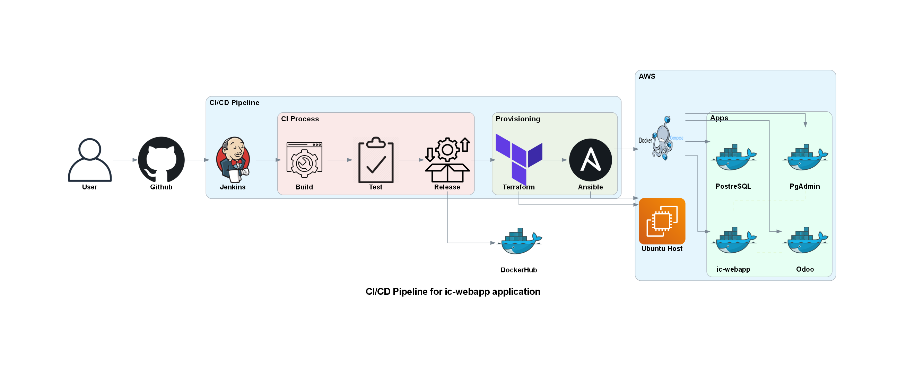
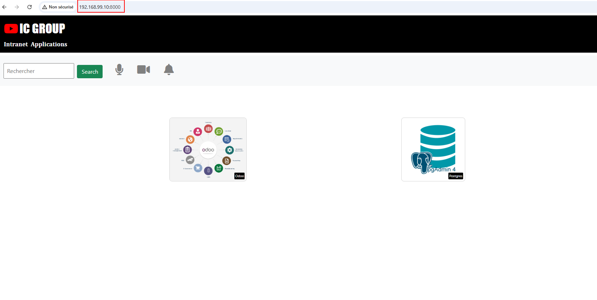
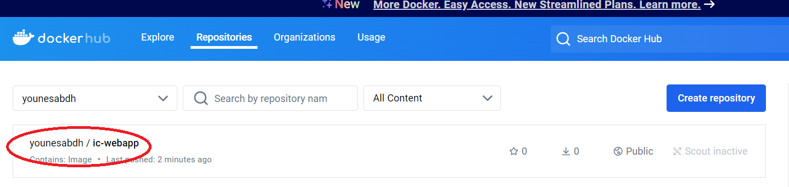

# Devops Final Project IC-GROUP



## Project overview

The **Devops Final Project** is the final project as part of the DevOps training program at [Eazytraining](https://eazytraining.fr/) school. Its goal is to provide both a practical and theoretical demonstration of the technical skills acquired during the DevOps Bootcamp, including **Docker**, **GitLab-CI**, **Jenkins**, **Terraform**, **Ansible**, and **Kubernetes**.

In this project, I implemented a comprehensive solution that includes:

- Containerization of applications.
- Setting up a CI/CD pipeline.
- Deploying applications on AWS ec2 using Ansible and docker-compose.

The applications involved are:
- **Odoo**: A multifunctional ERP used for enterprise management.
- **PgAdmin**: A graphical tool for managing PostgreSQL databases.
- **Ic-webapp**: A showcase website chich is containerized for easier deployment and management.

This project also demonstrates the integration of various tools and technologies to achieve automation, scalability, and efficient application deployment.

# Table of Contents  

[**Project overview**](#Project overview)

## PART 1: Web Application Containerization

This part outlines the steps to containerize the web application using Docker.
- The Docker image is based on `python:3.6-alpine`.
- The working directory is set to `/opt`.
-  Install the Flask module, version `1.1.2`.
- Expose the port `8080` as the default application port.
- Create two environment variables: `ODOO_URL`: to define the URLs of the Odoo and `PGADMIN_URL` applications.
- Launch the application by running `app.py` using the command `python` in the `ENTRYPOINT`.
- Create a `Dockerfile` with the above configurations.
- Build the Docker image using the following command:

  ```bash
  $ docker build -t ic-webapp:1.0 .

- Launch a test container to verify the functionality:

  ```bash
  $ docker run --name ic-webapp-test -d -p 8080:8080 ic-webapp:1.0

- Once the test is successful, remove the test container:

  ```bash
  $ docker rm -f ic-webapp-test

- Push the image to Docker Hub:
  ```bash
  $ docker tag ic-webapp:1.0 younesabdh/ic-webapp:1.0
  $ docker push younesabdh/ic-webapp:1.0

Here is the dresult of the test:



And the push in dockerhub:



# PART 2: CI/CD Pipeline Setup with Jenkins, Terraform and Ansible

## 1. Setting Up the AWS Infrastructure Using Terraform

The infrastructure consists of two main components:

1. **Local Server**:
   - A CentOS 7 VM set up locally.
   - This server has **Jenkins** installed.
   - It is used to execute the CI/CD pipeline.

2. **Application Hosting Servers**:
   - **Ubuntu VMs** running on EC2 instances of type `t2.medium`.
   - Separate servers are configured for the **development** and **production** environments.
   - These servers are created and managed using Terraform.

This setup ensures a clear separation of concerns, with the local server handling orchestration and the AWS-hosted servers running the applications.

3. **Terraform Project Directory Structure:**

This part of the project uses Terraform to provision essential AWS infrastructure required to deploy and manage applications via a CI/CD pipeline. The pipeline integrates with Jenkins and Terraform to automate the provisioning of EC2 instances, Elastic IPs (EIP), and Security Groups (SGs) for the application.

```bash
.
├── dev
│   ├── backend.tf
│   ├── files
│   │   └── ec2_IP.txt
│   ├── main.tf
│   ├── provider.tf
│   └── variables.tf
├── files
│   └── test.txt
├── modules
│   ├── ec2-module
│   │   ├── main.tf
│   │   ├── output.tf
│   │   └── variable.tf
│   ├── eip-module
│   │   ├── main.tf
│   │   ├── output.tf
│   │   └── variable.tf
│   └── sg-module
│       ├── main.tf
│       ├── output.tf
│       └── variable.tf
└── prod
    ├── backend.tf
    ├── files
    │   └── ec2_IP.txt
    ├── main.tf
    ├── provider.tf
    └── variables.tf
```

#### Essential Terraform Files and Their Roles:

1. **`dev/`** and **`prod/`**:
These directories separate your configurations for different environments (development and production). The files in these folders typically contain configurations specific to each environment.

2. **`ec2_IP.txt`**:
   is used to store the IP addresses of the created EC2 instances (likely for access purposes or further configuration).

3. **`ec2_module/main.tf`**: 
   Provisions an EC2 instance for hosting the application, this module is essential for creating the environment where the application will be deployed as part of the CI/CD pipeline.

4. **`eip_module/main.tf`**: 
   Allocates and associates an Elastic IP (EIP) to the provisioned EC2 instance. The Elastic IP ensures that the EC2 instance is accessible with a static IP, crucial for application access and integration in the pipeline.

5. **`sg_module/main.tf`**: Creates a security group that allows access to the EC2 instance via HTTP, HTTPS, SSH, and application-specific ports. This module ensures the application is accessible on the required ports and that the EC2 instance is secured against unnecessary traffic.

#### Key Variables:
These variables are defined in `variables.tf` and are used throughout the modules:

- **`instance_type`**: Defines the EC2 instance type to use.
- **`aws_ssh_key`**: SSH key pair used for EC2 instance access.
- **`sg_name`**: Name of the security group created for the EC2 instance.
- **`ec2_name_tag`**: Tag assigned to the EC2 instance for identification.
- **`az`**: Availability zone where the EC2 instance will be created.

#### Outputs:
- **`ec2_public_ip`**: The public IP address of the provisioned EC2 instance.
- **`eip_public_ip`**: The Elastic IP associated with the EC2 instance).

## 2. Ansible Roles to deploy Applications
This section focuses on deploying applications using Ansible by defining modular roles, configurations, and playbooks. Here's an overview of the essential components:

### Tree Structure Overview

```bash
.
├── ansible.cfg
├── group_vars
│   ├── all.yml
│   ├── dev.yml
│   └── prod.yml
├── host_vars
│   ├── dev-server.yml
│   └── prod-server.yml
├── hosts.yml
├── playbooks
│   ├── deploy_icwebapp.yml
│   ├── deploy_odoo.yml
│   ├── deploy_pgadmin.yml
│   ├── install_docker_linux.yml
│   └── test-connection.yml
└── roles
    ├── ic-webapp_role
    ├── install_docker_role
    ├── odoo_role
    └── pgadmin_role
```
### Key files

#### 1. `ansible.cfg`
- Central configuration file for Ansible.
- Specifies inventory location, roles path, and SSH connection parameters.
- Improves efficiency by caching facts and managing retries.

```ini
[defaults]
inventory = /var/jenkins_home/workspace/ic-webapp/sources/ansible/hosts.yml
host_key_checking = False
roles_path = /var/jenkins_home/workspace/ic-webapp/sources/ansible/roles
deprecation_warnings=False

[privilege_escalation]
become_ask_pass = true
```

#### 2. Inventory files

##### `hosts.yml`
Defines servers grouped by environments (e.g., dev, prod).

```yaml
all:
  children:
    dev:
      hosts:
        dev-server:
          ansible_host: <dev_server_ip>
    prod:
      hosts:
        prod-server:
          ansible_host: <prod_server_ip>
```

##### `group_vars` and `host_vars`

- **`group_vars`**: Store variables specific to environments:
  - `dev.yml`: Variables for the development environment.
  - `prod.yml`: Variables for the production environment.

- **`host_vars`**: Define host-specific variables:
  - `dev-server.yml`: Variables for the development server.
  - `prod-server.yml`: Variables for the production server.

#### 3. Roles Directory  

The `roles` directory contains reusable components for deploying applications. Each role includes the following:  
- **`Tasks`**: Define actions to execute.  
- **`Templates`**: Jinja2 templates for Docker Compose files.  
- **`Vars`**: Role-specific variables.  
- **`Handlers`**: Define notification triggers for tasks.  

##### Key Roles  

- **`ic-webapp_role`**:  
  - Deploys the `ic-Webapp` using Docker Compose.  
  - Includes a Jinja2 template (`icwebapp-docker-compose.yml.j2`) for the app's deployment.  

- **`install_docker_role`**:  
  - Installs Docker and Docker Compose on target servers.  

- **`odoo_role`** and **`pgadmin_role`**:  
  - Follow a similar structure, deploying their respective applications with customized Docker Compose templates.  

#### 4. Playbooks

Define tasks to execute roles or specific actions.

- ##### Examples:
  - `deploy_icwebapp.yml`:
    ```yaml
    - hosts: all
      roles:
        - ic-webapp_role
    ```
  - `install_docker_linux.yml`:
    ```yaml
    - hosts: all
      roles:
        - install_docker_role
    ```
- ##### Running the Playbooks: 
To run the playbooks, use the following command from the Ansible directory:  

```bash
cd sources/ansible/
ansible-playbook -i hosts.yml playbooks/install_docker_linux.yml
ansible-playbook -i hosts.yml playbooks/deploy_odoo.yml
ansible-playbook -i hosts.yml playbooks/deploy_pgadmin.yml
ansible-playbook -i hosts.yml playbooks/deploy_icwebapp.yml
``` 
