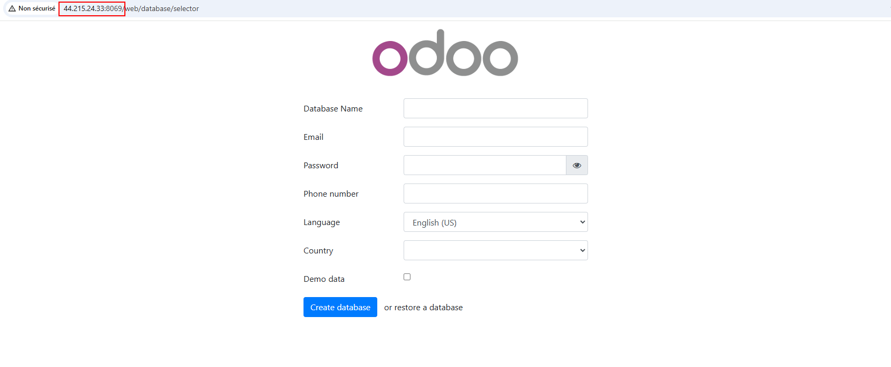
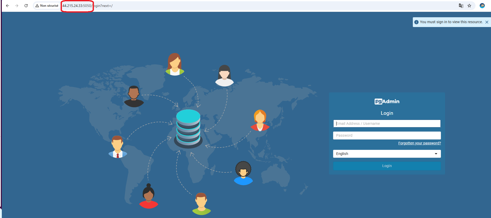

# Devops Final Project IC-GROUP


## Project overview:

The **Devops Final Project** is the final project as part of the DevOps training program at [Eazytraining](https://eazytraining.fr/) school. Its goal is to provide both a practical and theoretical demonstration of the technical skills acquired during the DevOps Bootcamp, including **Docker**, **GitLab-CI**, **Jenkins**, **Terraform**, **Ansible**, and **Kubernetes**.

In this project, I implemented a comprehensive solution that includes:

- Containerization of applications.
- Setting up a CI/CD pipeline.
- Deploying applications on AWS ec2 using Ansible and docker-compose.

The applications involved are:
- **Odoo**: A multifunctional ERP used for enterprise management.
- **PgAdmin**: A graphical tool for managing PostgreSQL databases.
- **Ic-webapp**: A showcase website chich is containerized for easier deployment and management.

This project also demonstrates the integration of various tools and technologies to achieve automation, scalability, and efficient application deployment.

# Table of Contents

- [Project Overview](#project-overview)
- [PART 1: Web Application Containerization](#part-1-web-application-containerization)
  - [Docker Image Configuration](#docker-image-configuration)
  - [Building and Testing the Docker Image](#building-and-testing-the-docker-image)
  - [Pushing the Docker Image to Docker Hub](#pushing-the-docker-image-to-docker-hub)
- [PART 2: CI/CD Pipeline Setup with Jenkins, Terraform, and Ansible](#part-2-cicd-pipeline-setup-with-jenkins-terraform-and-ansible)
  - [1. Setting Up the AWS Infrastructure Using Terraform](#1-setting-up-the-aws-infrastructure-using-terraform)
    - [Infrastructure Overview](#infrastructure-overview)
    - [Terraform Project Directory Structure](#terraform-project-directory-structure)
    - [Essential Terraform Files and Their Roles](#essential-terraform-files-and-their-roles)
    - [Key Variables](#key-variables)
    - [Outputs](#outputs)
  - [2. Ansible Roles to Deploy Applications](#2-ansible-roles-to-deploy-applications)
    - [Tree Structure Overview](#tree-structure-overview)
    - [Key Files](#key-files)
    - [Roles Directory](#roles-directory)
    - [Playbooks](#playbooks)
  - [3. CI/CD Pipeline with Jenkins](#3-cicd-pipeline-with-jenkins)
    - [Installing Necessary Plugins](#installing-necessary-plugins)
    - [Creating Credentials](#creating-credentials)
    - [Creating the Pipeline](#creating-the-pipeline)
    - [Slack Integration for Jenkins Notifications](#slack-integration-for-jenkins-notifications)
- [PART 3: Deployment of Different Applications in a Kubernetes Cluster](#part-3-deployment-of-different-applications-in-a-kubernetes-cluster)
  - [Overview of the Deployment](#overview-of-the-deployment)
  - [Kustomization File](#kustomization-file)
  - [Namespace](#namespace)
  - [Deployments](#deployments)
    - [1. PostgreSQL](#1-postgresql)
    - [2. pgAdmin](#2-pgadmin)
    - [3. Odoo](#3-odoo)
    - [4. Ic-Webapp](#4-ic-webapp)
  - [Deployment Steps](#deployment-steps)
- [Conclusion](#conclusion)


## PART 1: Web Application Containerization

This part outlines the steps to containerize the web application using Docker.
- The Docker image is based on `python:3.6-alpine`.
- The working directory is set to `/opt`.
-  Install the Flask module, version `1.1.2`.
- Expose the port `8000` as the default application port.
- Create two environment variables: `ODOO_URL`: to define the URLs of the Odoo and `PGADMIN_URL` applications.
- Launch the application by running `app.py` using the command `python` in the `ENTRYPOINT`.
- Create a `Dockerfile` with the above configurations.
- Build the Docker image using the following command:

  ```bash
  $ docker build -t ic-webapp:1.0 .

- Launch a test container to verify the functionality:

  ```bash
  $ docker run --name ic-webapp-test -d -p 8000:8000 ic-webapp:1.0

- Once the test is successful, remove the test container:

  ```bash
  $ docker rm -f ic-webapp-test

- Push the image to Docker Hub:
  ```bash
  $ docker tag ic-webapp:1.0 younesabdh/ic-webapp:1.0
  $ docker push younesabdh/ic-webapp:1.0

Here is the result of the test:


And the push in dockerhub:


## PART 2: CI/CD Pipeline Setup with Jenkins, Terraform and Ansible

### 1. Setting Up the AWS Infrastructure Using Terraform

The infrastructure consists of two main components:

1. **Local Server**:
   - A CentOS 7 VM set up locally.
   - This server has **Jenkins** installed.
   - It is used to execute the CI/CD pipeline.

2. **Application Hosting Servers**:
   - **Ubuntu VMs** running on EC2 instances of type `t2.micro`.
   - Separate servers are configured for the **development** and **production** environments.
   - These servers are created and managed using Terraform.

This setup ensures a clear separation of concerns, with the local server handling orchestration and the AWS-hosted servers running the applications.

3. **Terraform Project Directory Structure:**

This part of the project uses Terraform to provision essential AWS infrastructure required to deploy and manage applications via a CI/CD pipeline. The pipeline integrates with Jenkins and Terraform to automate the provisioning of EC2 instances, Elastic IPs (EIP), and Security Groups (SGs) for the application.

```bash
.
├── dev
│   ├── backend.tf
│   ├── files
│   │   └── ec2_IP.txt
│   ├── main.tf
│   ├── provider.tf
│   └── variables.tf
├── files
│   └── test.txt
├── modules
│   ├── ec2-module
│   │   ├── main.tf
│   │   ├── output.tf
│   │   └── variable.tf
│   ├── eip-module
│   │   ├── main.tf
│   │   ├── output.tf
│   │   └── variable.tf
│   └── sg-module
│       ├── main.tf
│       ├── output.tf
│       └── variable.tf
└── prod
    ├── backend.tf
    ├── files
    │   └── ec2_IP.txt
    ├── main.tf
    ├── provider.tf
    └── variables.tf
```

#### Essential Terraform Files and Their Roles:

1. **`dev/`** and **`prod/`**:
These directories separate your configurations for different environments (development and production). The files in these folders typically contain configurations specific to each environment.

2. **`ec2_IP.txt`**:
   is used to store the IP addresses of the created EC2 instances (likely for access purposes or further configuration).

3. **`ec2_module/main.tf`**: 
   Provisions an EC2 instance for hosting the application, this module is essential for creating the environment where the application will be deployed as part of the CI/CD pipeline.

4. **`eip_module/main.tf`**: 
   Allocates and associates an Elastic IP (EIP) to the provisioned EC2 instance. The Elastic IP ensures that the EC2 instance is accessible with a static IP, crucial for application access and integration in the pipeline.

5. **`sg_module/main.tf`**: Creates a security group that allows access to the EC2 instance via HTTP, HTTPS, SSH, and application-specific ports. This module ensures the application is accessible on the required ports and that the EC2 instance is secured against unnecessary traffic.

#### Key Variables:
These variables are defined in `variables.tf` and are used throughout the modules:

- **`instance_type`**: Defines the EC2 instance type to use.
- **`aws_ssh_key`**: SSH key pair used for EC2 instance access.
- **`sg_name`**: Name of the security group created for the EC2 instance.
- **`ec2_name_tag`**: Tag assigned to the EC2 instance for identification.
- **`az`**: Availability zone where the EC2 instance will be created.

#### Outputs:
- **`ec2_public_ip`**: The public IP address of the provisioned EC2 instance.
- **`eip_public_ip`**: The Elastic IP associated with the EC2 instance).

### 2. Ansible Roles to deploy Applications
This section focuses on deploying applications using Ansible by defining modular roles, configurations, and playbooks. Here's an overview of the essential components:

### Tree Structure Overview

```bash
.
├── ansible.cfg
├── group_vars
│   ├── all.yml
│   ├── dev.yml
│   └── prod.yml
├── host_vars
│   ├── dev-server.yml
│   └── prod-server.yml
├── hosts.yml
├── playbooks
│   ├── deploy_icwebapp.yml
│   ├── deploy_odoo.yml
│   ├── deploy_pgadmin.yml
│   ├── install_docker_linux.yml
│   └── test-connection.yml
└── roles
    ├── ic-webapp_role
    ├── install_docker_role
    ├── odoo_role
    └── pgadmin_role
```
### Key files

#### 1. `ansible.cfg`
- Central configuration file for Ansible.
- Specifies inventory location, roles path, and SSH connection parameters.
- Improves efficiency by caching facts and managing retries.

```ini
[defaults]
inventory = /var/jenkins_home/workspace/ic-webapp/sources/ansible/hosts.yml
host_key_checking = False
roles_path = /var/jenkins_home/workspace/ic-webapp/sources/ansible/roles
deprecation_warnings=False

[privilege_escalation]
become_ask_pass = true
```

#### 2. Inventory files

##### `hosts.yml`
Defines servers grouped by environments (e.g., dev, prod).

```yaml
all:
  children:
    dev:
      hosts:
        dev-server:
          ansible_host: <dev_server_ip>
    prod:
      hosts:
        prod-server:
          ansible_host: <prod_server_ip>
```

##### `group_vars` and `host_vars`

- **`group_vars`**: Store variables specific to environments:
  - `dev.yml`: Variables for the development environment.
  - `prod.yml`: Variables for the production environment.

- **`host_vars`**: Define host-specific variables:
  - `dev-server.yml`: Variables for the development server.
  - `prod-server.yml`: Variables for the production server.

#### 3. Roles Directory  

The `roles` directory contains reusable components for deploying applications. Each role includes the following:  
- **`Tasks`**: Define actions to execute.  
- **`Templates`**: Jinja2 templates for Docker Compose files.  
- **`Vars`**: Role-specific variables.  
- **`Handlers`**: Define notification triggers for tasks.  

##### Key Roles  

- **`ic-webapp_role`**:  
  - Deploys the `ic-Webapp` using Docker Compose.  
  - Includes a Jinja2 template (`icwebapp-docker-compose.yml.j2`) for the app's deployment.  

- **`install_docker_role`**:  
  - Installs Docker and Docker Compose on target servers.  

- **`odoo_role`** and **`pgadmin_role`**:  
  - Follow a similar structure, deploying their respective applications with customized Docker Compose templates.  

#### 4. Playbooks

Define tasks to execute roles or specific actions.

- ##### Examples:
  - `deploy_icwebapp.yml`:
    ```yaml
    - hosts: all
      roles:
        - ic-webapp_role
    ```
  - `install_docker_linux.yml`:
    ```yaml
    - hosts: all
      roles:
        - install_docker_role
    ```
- ##### Running the Playbooks: 
To run the playbooks, use the following command from the Ansible directory:  

```bash
cd sources/ansible/
ansible-playbook -i hosts.yml playbooks/install_docker_linux.yml
ansible-playbook -i hosts.yml playbooks/deploy_odoo.yml
ansible-playbook -i hosts.yml playbooks/deploy_pgadmin.yml
ansible-playbook -i hosts.yml playbooks/deploy_icwebapp.yml
```


### 3. CI/CD Pipeline with Jenkins:
In this section we give an an overview of setting up a CI/CD pipeline in Jenkins to automate the deployment of applications. It includes steps to configure Jenkins, manage necessary plugins, create credentials, and define a pipeline for seamless application deployment.

#### Installing Necessary Plugins

To ensure Jenkins has all the required functionality, install the following plugins:


#### Creating Credentials

Credentials are essential for Jenkins to securely access resources such as Docker Hub, SSH keys.


All these credentials are of type `secret text`, except one,  `aws_private_key` which is `secret file`

#### Creating the Pipeline

A Jenkins pipeline automates the build, test, and deploy stages of your application lifecycle.

##### Steps to Create the Pipeline

1. Navigate to **New Item** in Jenkins and select **Pipeline**.
2. Name the pipeline and click **OK**.


##### Configuring the Pipeline from SCM

Using a `Jenkinsfile` stored in the repository ensures that the pipeline configuration is version-controlled and easily replicable.
Configure the pipeline:
1. Under the **Pipeline** section, select **Pipeline script from SCM**.
2. Choose the **Git** option and provide:
   - In the **Pipeline** section, choose **Pipeline script from SCM**.
   - Select the repository containing the pipeline script (`Jenkinsfile`).
   - Specify the branch (`main`).
  


3. Specify the path to the `Jenkinsfile` (default is the root directory).

4. Add build parameters:


5. Navigate to the **Build Triggers** section and check **GITScm Polling** : this option ensures that Jenkins automatically triggers a pipeline run when changes are detected in the repository.


#### Slack Integration for Jenkins Notifications

To keep your team informed about the status of Jenkins builds and deployments, integrating Slack with Jenkins allows you to receive real-time notifications about pipeline activities such as successful builds, failures, and other important events.

To integrate Slack with Jenkins, we follow theses steps:

1. **Install the Slack Notification Plugin**:
   - Navigate to **Manage Jenkins** > **Manage Plugins**.
   - Search for **Slack Notification Plugin** and install it.

2. **Configure Jenkins for Slack Integration**:
   - Go to **Manage Jenkins** > **Configure System**.
   - Scroll down to **Slack**.
   - Enter the **workspace** you have restored earlier from your slack account.
   - Set the **Default Channel** to the channel you want notifications to be sent to (e.g., `#jenkins_eazytraining`).
   - Select the aduaquat credential to allow jenkins accessing and writting in the slack channel !


#### Shared library: 
In order to make the Slack notification available to all projects, we have created a Shared Library which will allow a simple call to be made in the Jenkinsfiles.
To configure that, we refer to Global Trusted Pipeline Libraries:

 

### Execution of the Pipeline

Once the Jenkins pipeline is triggered (either manually or through SCM polling), the stages outlined in the Jenkinsfile will be executed sequentially. Here's an overview of the steps involved:

1. **Build Image**  
   The pipeline begins by building the Docker image for the application.

2. **Run Container Based on Built Image**  
   A container is created and started based on the built image.
3. **Test Image**  
   The pipeline runs basic acceptance tests on the newly created container.

4. **Clean Container**  
   Any running containers are stopped and removed to avoid leaving unused resources.

5. **Login and Push Image to Docker Hub**  
 The image is pushed to Docker Hub for public access or storage, ensuring that the most recent version is available.

6. **Provision DEV Environment on AWS**  
   This stage provisions the development environment on AWS using Terraform.
   
7. **Deploy Application on DEV Environment**  
   Once the DEV environment is set up, Ansible is used to install Docker and deploy the application on the EC2 instance.
   
8. **Delete DEV Environment and Provision PROD Environment**  
   The pipeline prompts for confirmation before deleting the DEV environment and proceeding to create the production environment using Terraform.

9. **Deploy Application on PROD Environment**  
   The pipeline deploys the application on the production environment.
   
11. **Post-Build Actions**  
    After the pipeline finishes, a Slack notification is sent indicating the result of the build.


#### Results






## Part 3: Deployment of Different Applications in a Kubernetes Cluster

This section describes how the project deploys various applications in a Kubernetes cluster using manifest files. The deployments include setting up a PostgreSQL database, Odoo, pgAdmin, and a custom IC Web App. These deployments are managed and configured through a `kustomization.yaml` file that organizes and references all required Kubernetes manifests.

### **Overview of the Deployment**

The deployment leverages Kubernetes resources, including namespaces, secrets, ConfigMaps, services, and deployments, to ensure the proper functioning of all applications. The applications and their dependencies are organized into logical directories, each containing relevant manifests.

### **Kustomization File**

The `kustomization.yaml` file consolidates all manifests to facilitate easier management and deployment. Below is the list of resources included in the file:

```yaml
resources:
  - ic-group-namespace.yaml
  - ./postgres/postgres-secret.yaml
  - ./odoo/odoo-secret.yaml
  - ./pgadmin/pgadmin-secret.yaml
  - ./pgadmin/pgadmin-configmap.yaml
  - ./postgres/postgres-clusterip.yaml
  - ./ic-webapp/ic-webapp-nodeport.yaml
  - ./odoo/odoo-nodeport.yaml
  - ./pgadmin/pgadmin-nodeport.yaml
  - ./postgres/postgres-deploy.yaml
  - ./pgadmin/pgadmin-deploy.yaml
  - ./odoo/odoo-deploy.yaml
  - ./ic-webapp/ic-webapp-deploy.yaml
```

### **Namespace**

The resources are deployed within a dedicated namespace, `icgroup`, as defined in the `ic-group-namespace.yaml` manifest:

```yaml
apiVersion: v1
kind: Namespace
metadata:
  name: icgroup
  labels:
    env: prod
```

This namespace ensures logical isolation for the deployed resources.

#### **Deployments**

##### **1. PostgreSQL**

The PostgreSQL database is deployed using a StatefulSet, which provides stable network identifiers and persistent storage. This deployment ensures data integrity and availability, even in case of pod restarts or re-scheduling. Sensitive configuration details, such as passwords, are securely stored in a Kubernetes secret.

**Manifest (`postgres-deploy.yaml`):**

```yaml
apiVersion: apps/v1
kind: StatefulSet
metadata:
  name: postgres-prod
  namespace: icgroup
  labels:
    app: postgres
    env: prod
spec:
  replicas: 1
  selector:
    matchLabels:
      app: postgres
  template:
    metadata:
      labels:
        app: postgres
    spec:
      containers:
      - name: postgres
        image: postgres
        ports:
        - containerPort: 5432
        env:
        - name: POSTGRES_DB
          value: postgres
        - name: POSTGRES_USER
          value: odoo
        - name: POSTGRES_PASSWORD
          valueFrom:
            secretKeyRef:
              name: postgres-scrt
              key: POSTGRES_PASSWORD
        volumeMounts:
        - mountPath: /var/lib/postgresql/data
          name: db-volume
      volumes:
      - name: db-volume
        hostPath:
          path: /db-data
          type: DirectoryOrCreate
```

##### **2. pgAdmin**

pgAdmin, a web-based database management tool, is deployed to provide an intuitive interface for managing PostgreSQL databases. Its configuration is sourced from a `ConfigMap` for non-sensitive data and a `Secret` for sensitive credentials. Persistent storage is ensured using a `hostPath` volume.

**Manifest (`pgadmin-deploy.yaml`):**

```yaml
apiVersion: apps/v1
kind: Deployment
metadata:
  name: pgadmin-prod
  namespace: icgroup
  labels:
    app: pgadmin
    env: prod
spec:
  replicas: 1
  strategy:
    type: Recreate
  selector:
    matchLabels:
      app: pgadmin-pods
  template:
    metadata:
      labels:
        app: pgadmin-pods
    spec:
      containers:
      - image: dpage/pgadmin4
        name: pgadmin-ctnr
        securityContext:
          runAsUser: 0
          runAsGroup: 0
        ports:
        - containerPort: 80
        env:
        - name: PGADMIN_DEFAULT_EMAIL
          value: admin@pgadmin.com
        - name: PGADMIN_DEFAULT_PASSWORD
          valueFrom:
            secretKeyRef:
              name: pgadmin-secret
              key: PGADMIN_DEFAULT_PASSWORD
        volumeMounts:
        - name: servers
          mountPath: /pgadmin4/servers.json
        - name: pg-volume
          mountPath: /var/lib/pgadmin
      volumes:
      - name: servers
        configMap:
          name: pgadmin-configmap
      - name: pg-volume
        hostPath:
          path: /pg-data
          type: DirectoryOrCreate
```

##### **3. Odoo**

Odoo, an open-source suite of business applications, is deployed with a rolling update strategy to ensure minimal disruption during updates. The configuration includes environment variables for connecting to the PostgreSQL database and other dependencies.

**Manifest (`odoo-deploy.yaml`):**

```yaml
apiVersion: apps/v1
kind: Deployment
metadata:
  name: odoo-prod
  namespace: icgroup
  labels:
    app: odoo
    env: prod
spec:
  replicas: 2
  strategy:
    type: RollingUpdate
    rollingUpdate:
      maxSurge: 1
      maxUnavailable: 1
  selector:
    matchLabels:
      app: odoo-pods
  template:
    metadata:
      labels:
        app: odoo-pods
    spec:
      containers:
      - image: odoo:latest
        name: odoo-ctnr
        env:
        - name: POSTGRES_URL
          value: http://postgres-prod.icgroup.svc.cluster.local:5432
        ports:
        - containerPort: 8069
```

##### **4. Ic-Webapp**

The IC Web App, a custom application, is deployed with a replica count of 2 for redundancy and rolling updates to ensure seamless upgrades with minimal downtime. Environment variables are used to connect the app to external services like Odoo and pgAdmin.

**Manifest (`ic-webapp-deploy.yaml`):**

```yaml
apiVersion: apps/v1
kind: Deployment
metadata:
  name: ic-webapp-prod
  namespace: icgroup
  labels:
    app: ic-webapp
    env: prod
spec:
  replicas: 2
  strategy:
    type: RollingUpdate
    rollingUpdate:
      maxSurge: 1
      maxUnavailable: 1
  selector:
    matchLabels:
      app: ic-webapp-pods
  template:
    metadata:
      labels:
        app: ic-webapp-pods
    spec:
      containers:
      - image: younesabdh/ic-webapp:v1.0
        name: ic-webapp-ctnr
        env:
        - name: ODOO_URL
          value: http://192.168.99.11:30200
        - name: PGADMIN_URL
          value: http://192.168.99.11:30300
        ports:
        - containerPort: 8080
```

#### **Deployment Steps**

1. **Ensure the Kubernetes cluster is running and accessible.**

2. **Apply the manifests**:

   Use the `kubectl apply -k` command to apply the resources defined in the directory containing the `kustomization.yaml` file:

```bash
   kubectl apply -k .
```

4. **Verify the Deployment**:

To ensure that all resources have been deployed correctly, run the following command to list the resources in the `icgroup` namespace:

```bash
kubectl get all -n icgroup
```


4. **Access the applications**: 

Access the deployed applications using their respective NodePort services, which expose the applications to the external network.

- ic-webapp:


- Odoo:


- Pgadmin:


 


## **Conclusion**

The **IC-Group Project** has been an invaluable learning experience, allowing me to apply the DevOps concepts and tools studied during this BootCamp in a practical and cohesive way. Through this project, I successfully implemented a fully functional CI/CD pipeline, integrating the essential modules as **Docker, Jenkins, Terraform, Ansible, and Kubernetes**. This achievement highlights my ability to design, automate, and manage modern infrastructure while reinforcing the theoretical foundations acquired throughout the course. It serves as a solid demonstration of my readiness to tackle complex DevOps challenges in professional environments.

Thank you for exploring this project, feel free to reach out with any feedback or questions to further enhance its implementation and functionality!


